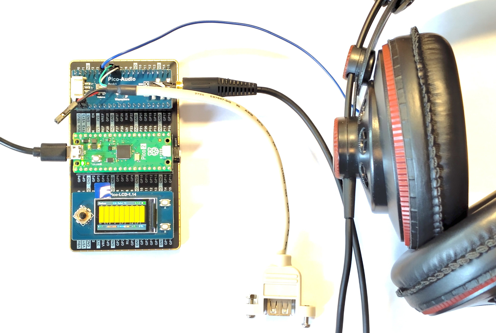
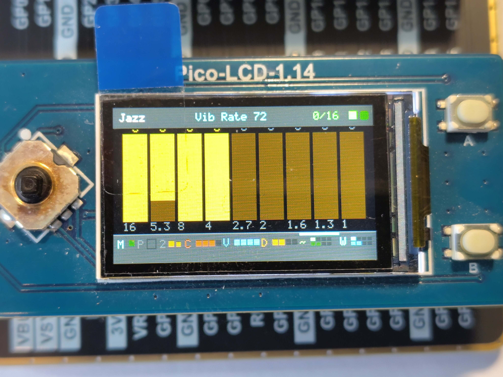
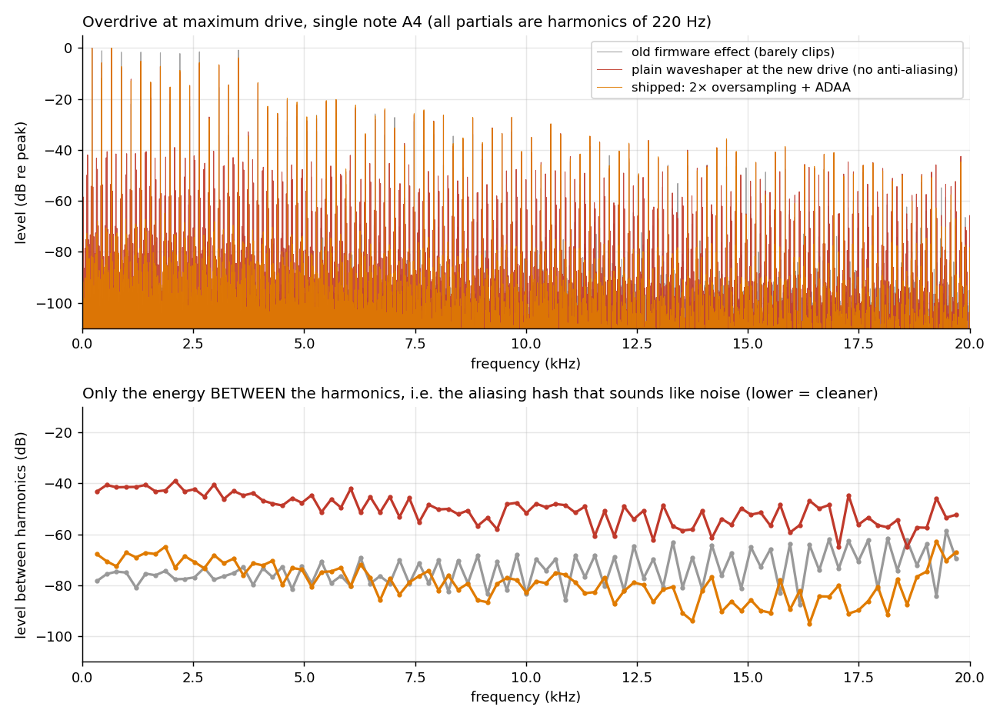
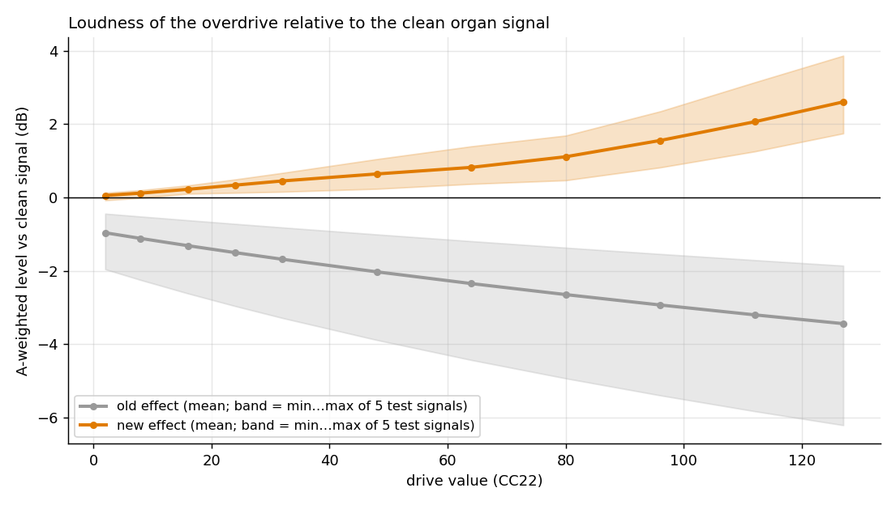
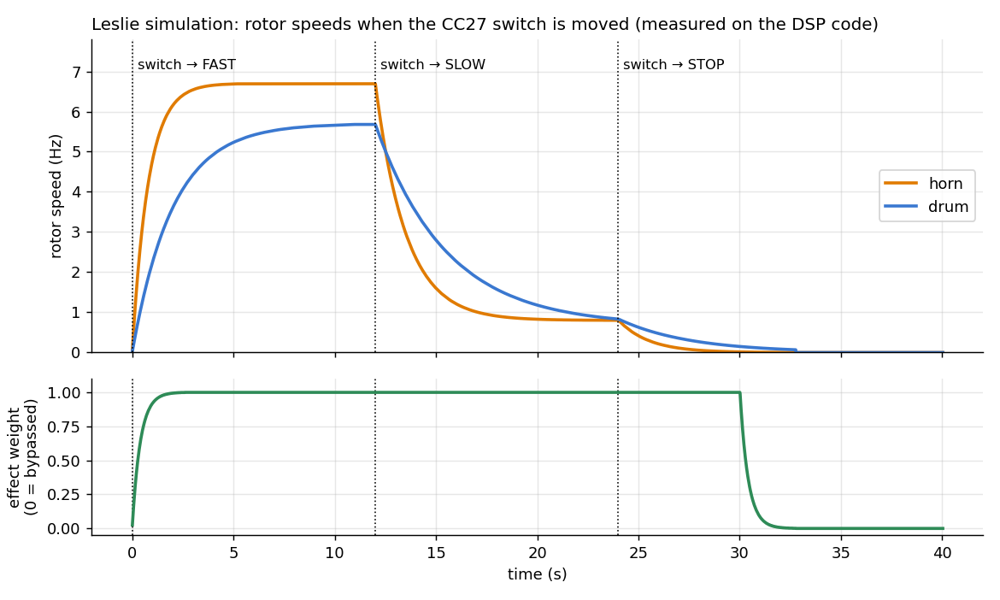

# Pico Tonewheel Organ

A Hammond-style tonewheel organ sound module built on a **Raspberry Pi Pico 2 (RP2350)**: nine-drawbar polyphonic tonewheel synthesis, percussion and key click, and an effects chain with **overdrive, vibrato, chorus and a stereo Leslie rotary-speaker simulation**. It plays from a home-built keyboard unit, from any USB MIDI controller plugged into its USB-A host socket, or from a computer. A small colour LCD shows the drawbars and effect settings.



> **TODO (author):** add 2–3 photos to `images/` — the finished instrument, the inside of the case, the front panel — and reference them here.

**Highlights**

- 16-note polyphony (9 partials per note) with Hammond drawbar footages, first-note-only percussion (2nd/3rd harmonic, fast/slow, soft/normal) and key click
- Overdrive: anti-aliased tube-style clipper with loudness-following makeup
- Vibrato (authentic ±0.25 semitone scanner depth), dual-quadrature chorus
- Leslie simulation: horn + drum rotors, Doppler, two microphones, **slow / stop / fast with realistic run-up and run-down**
- Three MIDI inputs merged: UART (keyboard unit), USB host (controllers), USB device (computer)
- A **load governor** that drops notes gracefully instead of letting the pitch fall or the DAC mute
- Everything controllable three ways: MIDI CC, joystick + LCD, serial console
- Runs from SRAM on core 1; I²S audio through a PIO state machine

## Contents

1. [The big picture](#1-the-big-picture)
2. [What you need](#2-what-you-need)
3. [Building the hardware](#3-building-the-hardware)
4. [Firmware: build, flash, first power-on](#4-firmware-build-flash-first-power-on)
5. [Playing it: controls](#5-playing-it-controls)
6. [How it works](#6-how-it-works)
7. [Tuning guide](#7-tuning-guide)
8. [Testing and verification status](#8-testing-and-verification-status)
9. [Troubleshooting](#9-troubleshooting)
10. [Limitations and roadmap](#10-limitations-and-roadmap)
11. [Repository layout, licence, credits](#11-repository-layout-licence-credits)

---

## 1. The big picture


The organ is two cooperating units:

| Unit | What it does | Where |
|------|--------------|-------|
| **Keyboard & control unit** | Scans the keys, reads 16 analog controls (drawbars, pots, switches) and sends them as MIDI | companion project *pico MIDI keyboard* (RP2040 Pico) |
| **Tone generator** | Receives MIDI, synthesises and processes the sound, drives the DAC and the display | **this repository** (Pico 2) |

The tone generator accepts MIDI from **three sources at once** and treats them identically: the UART input (GP5, 31 250 baud — the keyboard unit), the USB-A host socket (one class-compliant USB MIDI device) and its native USB port (computer / DAW). Because everything is just MIDI, the sound module also works with nothing but a USB keyboard plugged in.

---

## 2. What you need

### 2.1 Tone generator (this repository)

| Qty | Part | Notes |
|-----|------|-------|
| 1 | Raspberry Pi **Pico 2** (RP2350) | The build needs three PIO blocks and the Cortex-M33 FPU — a Pico 1 will not do |
| 1 | Waveshare **Pico-Audio** (Rev 2.1, CS4344 DAC) | stacks on the Pico; I²S pins are hard-wired on its PCB |
| 1 | Waveshare **Pico-LCD-1.14** (ST7789V 240×135, joystick, 2 buttons) | stacks on the Pico-Audio; pins hard-wired |
| 1 | USB-A socket (breakout or panel mount) | for the USB host input |
| 1 | 15 kΩ resistor | D+ pull-down — **required**, makes the Pico a USB host |
| 1 | Schottky diode (e.g. 1N5819) + 100 µF electrolytic + 100 nF ceramic | *recommended*: isolates power-hungry controllers (see [3.4](#34-power-and-noise)) |
| — | Hook-up wire, pin headers, USB cable for programming | |
| opt. | DIN-5 MIDI-in circuit (optocoupler 6N138 or similar) | feeds the same GP5 input; not part of the tested build |

> **TODO (author):** add supplier links / part numbers, the header arrangement used for the stack (or the expansion board mentioned below), power supply details (USB 5 V vs. VSYS) and the cost.
>
> The hardware note from the original README still applies: *the boards can be stacked, or used (for now) on an expansion board; a board combining MIDI-in and USB-host in is in the pipeline so the whole module can be a compact stack.*

### 2.2 Keyboard & control unit (companion project)

As built by the author (see the separate *pico MIDI keyboard* repository):

- Raspberry Pi Pico (RP2040), PlatformIO / earlephilhower core
- key matrix: 12 receive lines (GPIO0–11) and 16 send lines through two **74HC238** decoders (GPIO13/14/15 + 16); two selectable layouts — a double-row keyboard (two manuals) or velocity-sensing keys with make/break contacts
- **16 analog controls through a 4067 multiplexer** into ADC0 (GPIO26; mux select GPIO17/18/19/22): nine drawbars, three pots, three three-state switches, one Leslie switch
- MIDI out on UART TX (GPIO12 in the current firmware), 31 250 baud
- OLED + M5Stack encoder on I²C (GPIO20/21) for setup

> **TODO (author):** link the keyboard-unit repository, add its BOM, schematic and photos. Document the drawbar/pot/switch wiring (which mux channel is which CC).

### 2.3 Enclosure and panel

> **TODO (author) — everything needed to cut and assemble the case.** Suggested contents of a `hardware/` folder, each referenced from here:
>
> | File | Purpose |
> |------|---------|
> | `hardware/enclosure/*.svg` / `*.dxf` | laser-cut drawings, one file per material thickness |
> | `hardware/enclosure/README.md` | material (e.g. 3 mm birch ply / acrylic), kerf compensation used, assembly order, screws |
> | `hardware/panel/` | front-panel drawing with cut-outs: LCD window (Pico-LCD-1.14 active area), joystick + 2 buttons, USB-A socket, 3.5 mm audio jack, USB programming port access, MIDI in |
> | `hardware/bom.csv` | one machine-readable bill of materials |
> | `docs/photos/` | build photos in assembly order |
>
> A photo of the cut parts laid out, and one of the open case with the cabling, will save every builder an evening.

### 2.4 Tools

PlatformIO (VS Code extension or CLI), a soldering iron, a USB cable, and a serial terminal (the PlatformIO monitor works, 115 200 baud).

---

## 3. Building the hardware

### 3.1 The stack and the pins

```
[Pico-LCD-1.14]   ← top
[Pico-Audio]      ← middle   (pass-through header exposes all Pico pins)
[Pico 2]          ← bottom
```


Only **three connections are wired by hand**: GP5 (MIDI in), GP6/GP7 (USB host). Everything else is fixed by the two Waveshare boards, and there is **no conflict** between them.

| Function | GPIO |
|----------|------|
| I²S: DIN / BCK / LRCK (Pico-Audio, hard-wired) | GP22 / GP26 / GP27 |
| LCD: DC, CS, SCK, MOSI, RST, backlight (SPI1) | GP8, GP9, GP10, GP11, GP12, GP13 |
| Joystick: UP, DOWN, LEFT, RIGHT, PRESS | GP2, GP18, GP16, GP20, GP3 |
| Buttons A, B | GP15, GP17 |
| MIDI in (UART1 RX) | GP5 |
| USB host D+, D− | GP6, GP7 |

### 3.2 USB host socket and UART link


1. **USB-A socket:** D+ → GP6, D− → GP7, GND → GND, VBUS → VSYS (pin 39) — preferably through the Schottky diode with the 100 µF + 100 nF capacitors on the socket side. **Fit the 15 kΩ resistor from GP6 to GND.** Without it the Pico never sees a device attach.
2. **MIDI link from the keyboard unit:** its UART TX → GP5, plus a common ground. Both boards are 3.3 V logic, so no optocoupler is needed between them.
3. Optional DIN-5 input: any standard MIDI-in optocoupler circuit can feed GP5.

> Pin order of the USB-A socket, looking into the socket: 1 VBUS (red), 2 D− (white), 3 D+ (green), 4 GND (black).

### 3.3 Programming the first time

Hold BOOTSEL while plugging the Pico 2 into the computer, then upload with PlatformIO (see section 4). Later uploads work without BOOTSEL.

### 3.4 Power and noise

A power-hungry controller on the USB host socket (the author observed it with an AKAI MPK mini; a small nanoKEY never caused it) can put **audible noise on the audio output** through the shared supply rail. The diode + capacitors in 3.2 prevent it. If you still hear noise, power the Pico from a clean 5 V supply rather than a laptop USB port.

> **TODO (author):** state how the module is powered in the finished case.

### 3.5 Suggested build photos

> **TODO (author):** the stack from the side; the USB-A socket wiring close-up; the MIDI link; the finished panel.

---

## 4. Firmware: build, flash, first power-on

### 4.1 Toolchain

- VS Code + PlatformIO (or the PlatformIO CLI)
- Platform: `https://github.com/maxgerhardt/platform-raspberrypi.git`, framework Arduino, **earlephilhower** core
- Libraries (fetched automatically): Adafruit TinyUSB, FortySevenEffects MIDI Library
- The PIO-based USB host library is **vendored** in `lib/pio_usb/` (Pico-PIO-USB v0.5.3 plus a small compatibility stub — see [section 9](#9-troubleshooting))

> **TODO (author):** pin the TinyUSB version that builds on your machine (`pio pkg list` shows it) in `platformio.ini`; the file currently tracks the latest release, which can change under you.

### 4.2 Environments

| Environment | Target | Clock | Notes |
|-------------|--------|-------|-------|
| `pico2_tone` | Pico 2 | 240 MHz | **the full build**: USB host, effects, governor |
| `pico2_nohost` | Pico 2 | 200 MHz | no USB host (audio / MIDI-device testing) |
| `pico_tone` | Pico 1 | 133 MHz | **outdated** — see [limitations](#10-limitations-and-roadmap) |

240 MHz is used for the USB host build because it gives exact integer PIO clock divisors for USB full speed. The audio clock divisor is computed at run time from the real system clock, so pitch is unaffected.

```bash
pio run -e pico2_tone --target upload
pio device monitor            # 115200 baud
```

### 4.3 First power-on checklist

1. The LCD lights and shows the drawbars. A green square appears at the top right (audio load).
2. In the serial monitor: `help` lists the commands; `info` prints the organ state.
3. Plug in a USB MIDI keyboard — you should see `MIDI mounted idx=0 addr=1`, then `ON n=…` for each key.
4. Type `db 888000000` and play a note: a full gospel organ sound from both channels of the 3.5 mm output.
5. Type `perf` while holding a chord: the load split and polyphony limit appear.

---

## 5. Playing it: controls

### 5.1 The control panel and the MIDI CC map


| CC | Control | Range / behaviour |
|----|---------|-------------------|
| 12 – 20 | Drawbars 1–9 (16′ … 1′) | 0–127 → level 0–8 |
| 21 | Master volume | 0–127 |
| 22 | Overdrive | 0 = off, 1–127 = more |
| 23 | Chorus | one pot sets depth **and** mix together |
| 24 | Percussion switch | 2 = off · 62 = on, 2nd harmonic · 126 = on, 3rd harmonic |
| 25 | Vibrato switch | 2 = off · 62 = medium · 126 = high |
| 26 | Key-click switch | 2 = off · 62 = medium · 126 = high |
| 27 | **Leslie** switch | 2 = slow · 62 = stop · 126 = fast |
| 80 – 83 | Percussion detail | on/off · harmonic · decay (fast/slow) · level (soft/norm), each ≥ 64 = second option |
| 84 | Key-click level | 0–127 |
| 86 – 90 | Fine control | vibrato depth / rate · chorus depth / rate / mix |
| PC 0 – 3 | Program change | Full organ · Jazz · Flute · all off |

Three-state switches decode with thresholds at 32 and 94, so the values 2 / 62 / 126 (or anything near) work. The Leslie switch order can be swapped in `config.h` (`LESLIE_POS_*`). **Every received CC is printed on the serial console** — the quickest way to check what your own controller sends. By default all MIDI channels are accepted (`MIDI_CHANNEL 0` = OMNI).

### 5.2 Display and joystick




| Input | Action |
|-------|--------|
| Joystick LEFT / RIGHT | walk through: drawbars 1–9, click, volume, drive, vibrato depth / rate, chorus depth / rate / mix |
| Joystick UP / DOWN | change the selected value (drawbars ±1 level, others ±8). **Down pulls a drawbar down**, like a real one |
| Joystick PRESS | cycle presets: Full → Jazz → Flute |
| Button A | cycle the percussion settings |
| Button B | toggle key click |

Top bar: preset · selected parameter · **held notes / voice limit** (red when the governor is holding you back) · load square (green < 50 %, orange < 80 %, red) · MIDI dot.

### 5.3 Serial commands

115 200 baud, line-terminated.

| Command | Effect |
|---------|--------|
| `help`, `info`, `all` | command list · organ state · all notes off |
| `db 888000000` | set the nine drawbars (digits 0–8) |
| `pre full\|jazz\|flute\|off` | load a preset |
| `perc on\|off\|2\|3\|fast\|slow\|soft\|norm` | percussion |
| `click <0-127>`, `vol <0-127>` | key-click level, master volume |
| `drive <0-127>` | overdrive (0 = off) |
| `vib d <0-127>`, `vib r <0-127>` | vibrato depth, rate |
| `cho d\|r\|m\|a <0-127>` | chorus depth, rate, mix, **amount** (depth + mix together, like the pot) |
| `les stop\|slow\|fast` | Leslie speed |
| `perf` | audio load breakdown, polyphony limit, measured cost per oscillator |
| `pio` | audio PIO state |

---

## 6. How it works

### 6.1 Two cores


**Core 0** runs `loop()`: it polls the MIDI sources and the USB host, routes notes and CCs into the organ, handles the joystick, renders the LCD at 30 Hz and reads the serial console. **Core 1** runs only the audio loop, from SRAM: for each 256-sample buffer it computes one sample, pushes it into the PIO FIFO (paced by the DAC clock), and then lets the governor look at how long it all took.

The two cores share one global object, the organ. Core 0 takes its spinlock with `spin_lock_unsafe_blocking()`; core 1 only ever *tries* the lock, so it can never wait for core 0. Parameters are single bytes, so core 0 can write them without a lock.

Three rules came out of painful debugging and should not be broken (details in `context.md`):

1. **Never `spin_lock_blocking()`** — it disables interrupts, so USB MIDI packets get lost under chord bursts.
2. **Never compute a whole buffer and push it afterwards.** The PIO FIFO holds only a few samples; if it runs dry the I²S clocks stop and the CS4344 mutes.
3. **Audio code must run from SRAM and never block.** Everything on core 1 is force-inlined into `loop1()`, because code executed from flash competes with core 0 for the small XIP cache.

### 6.2 PIO allocation


`audio_driver_init()` must run before `usb_host_init()` so the audio state machine claims PIO2 first and TinyUSB takes PIO0/PIO1.

### 6.3 The tonewheel engine

Each note is one **voice** with nine **partials**, one per drawbar:

| Drawbar | 1 | 2 | 3 | 4 | 5 | 6 | 7 | 8 | 9 |
|---------|---|---|---|---|---|---|---|---|---|
| Footage | 16′ | 5⅓′ | 8′ | 4′ | 2⅔′ | 2′ | 1⅗′ | 1⅓′ | 1′ |
| Frequency × note | 0.5 | 1.5 | 1 | 2 | 3 | 4 | 5 | 6 | 8 |

A partial is a 32-bit phase accumulator reading a 4096-point sine table; its amplitude is `drawbar level / 8`. Only partials that actually sound (level > 0, below 22 kHz) are iterated, and the sum is scaled **once** for all voices. The inner loop is about 15 integer instructions per sounding partial.

- **Percussion** fires only on the first note of a new chord (authentic Hammond behaviour), at the 2nd or 3rd harmonic, fast or slow decay, soft or normal; while it is on, the 8′ drawbar is reduced by 25 % as on the original.
- **Key click** is a short noise burst on key press and release.
- **Vibrato** modulates the partials' phase increments with a sine LFO (0.5–9 Hz, depth up to ±0.25 semitone). The multiplier is applied once per 16 samples, in integer arithmetic, so there is no `powf()` and no per-oscillator float work in the audio path.

### 6.4 The effects chain


Order: voices → percussion + click → **overdrive → chorus → Leslie** → master volume → clip → I²S. Each effect costs almost nothing when it is off (Leslie and overdrive bypass completely).

#### Overdrive


An asymmetric soft clipper (even + odd harmonics, valve-like) with gain from 0 to +36 dB. It had to be built carefully, because **a plain waveshaper at this drive aliases badly**: harmonics above 22 kHz fold back as inharmonic hash that sounds like noise. The shipped design uses 2× oversampling and antiderivative anti-aliasing, a gentle roll-off (16 kHz at low drive → 5 kHz at max) and a DC blocker, and keeps the **bass out of the clipper** so low notes stay clean. A loudness-following makeup keeps the level about **+2.5 dB over the clean signal at maximum drive** (set by `OD_LEVEL_DB`) for one note or a six-note chord alike.



*Single note A4, maximum drive. Lower panel: only the energy between the harmonics (the aliasing hash). The shipped effect (orange) sits 25–30 dB below the plain waveshaper (red) and on the floor of the old, much milder effect (grey).*



*Loudness relative to the clean organ signal across five test signals (one quiet note to a six-note full-drawbar chord). The old effect got quieter as drive increased; the new one rises smoothly and stays within about 2 dB across very different playing.*

Cost: roughly 250–300 cycles per sample (~5 % of the audio budget), paid only while drive > 0.

#### Chorus

Two delay lines (20 ms centre, up to ±2 ms swing, 0.2–3 Hz) driven by LFOs a quarter cycle apart — the Boss CE-2 arrangement. When one LFO reverses direction (the moment a single delay line clicks), the other is moving at its steadiest, so the artefact cancels. Depth and mix are independent; the panel pot sets both.

#### Leslie


A crossover at 800 Hz splits the signal: the **horn** (highs) gets a modulated delay — the Doppler pitch shift, ±0.5 ms, about ±2 % pitch at full speed — plus 60 % amplitude modulation; the **drum** (lows) gets 40 % amplitude modulation. Two virtual microphones a quarter turn apart give a **stereo** output. Switching speeds does not jump: the rotors accelerate and decelerate exponentially with different inertia for horn and drum, exactly the "wind-up" you hear on a real cabinet. On "stop" the rotors wind down and the effect then fades to the dry signal and switches itself off completely.



*Rotor speeds measured from the DSP code while the switch is moved fast → slow → stop.*

### 6.5 The load governor


On a heavy chord with every effect on, the audio core can run out of time. Without protection the I²S clock stretches (the pitch falls) and finally the DAC loses lock and mutes. The governor prevents that: every buffer it measures what each oscillator really costs on this chip, works out how many notes fit under 80 % load, and lowers `voiceLimit` accordingly. Surplus notes **fade out over 5 ms, oldest first** — you lose notes, never pitch or sound. Switching effects on lowers the limit; switching them off gives the notes back, one per second. Run `perf` to see the numbers.

### 6.6 MIDI input and the USB host

All three sources call the same `midi_note_on / off / cc / program_change / pitch_bend` functions. The USB host (TinyUSB + PIO-USB, full speed) mounts **one** USB MIDI device; the callbacks must never block (no `_sync` TinyUSB calls), otherwise enumeration of other devices stalls. On disconnect all notes are released.

---

## 7. Tuning guide

Everything user-facing lives in `include/config.h`.

| Setting | Default | Effect |
|---------|---------|--------|
| `MAX_ACTIVE_VOICES` | 16 | hard polyphony ceiling (the governor lowers it further when needed) |
| `GOV_TARGET_LOAD_PCT` | 80 | audio load the governor aims to stay under |
| `GOV_MIN_VOICES` | 3 | the governor never limits below this |
| `VOICE_FADE_SAMPLES` | 220 | fade-out length of a stolen note (~5 ms) |
| `VIBRATO_MAX_SEMITONES` | 0.25 | vibrato depth at maximum (0.25 = scanner vibrato; 0.5 = obvious) |
| `VIBRATO_SWITCH_MEDIUM / HIGH` | 64 / 127 | depth for the vibrato switch positions |
| `CLICK_LEVEL_MEDIUM / HIGH` | 40 / 110 | click levels for the click switch |
| `OD_MAX_GAIN_DB` | 36 | drive gain at maximum; higher adds little clipping but more aliasing |
| `OD_LEVEL_DB` | 2.5 | overdrive loudness at maximum relative to clean |
| `OD_GAIN_CURVE` | 1.0 | 1.0 = gain in dB linear with the pot; > 1 back-loads the effect |
| `OD_LPF_HIGH_HZ / LOW_HZ` | 16 k / 5 k | post-clipper roll-off at low / max drive |
| `LESLIE_*_HZ` | 0.8 / 6.7 · 0.67 / 5.7 | horn / drum speeds, slow / fast |
| `LESLIE_*_ACCEL_S / DECEL_S` | 0.8 / 1.5 · 2.0 / 3.5 | rotor run-up / run-down time constants |
| `LESLIE_HORN_DEPTH / DRUM_DEPTH` | 0.6 / 0.4 | amplitude-modulation depth |
| `LESLIE_STEREO` | 1 | 0 = both outputs identical (mono amp) |
| `LESLIE_POS_LOW / MID / HIGH` | slow / stop / fast | what each position of the CC27 switch selects |
| `CHORUS_MIX_DEFAULT` | 64 | default wet level |
| `MIDI_CHANNEL` | 0 | 0 = all channels, 1–16 = one channel |
| `ENABLE_LCD / SERIAL / USB_HOST / PERF` | 1 | feature switches |

If you change the overdrive clipper, filters or `OD_GAIN_CURVE`, the makeup calibration in `Overdrive::Overdrive()` has to be re-measured (the comment there explains how).

---

## 8. Testing and verification status

Being clear about what is verified how:

**Confirmed by the author on the hardware:** audio and MIDI from all three inputs; drawbars, percussion, click; vibrato, chorus, Leslie and overdrive sound and behave as intended; the load governor stops the pitch falling and the freezes at 6–7 notes.

**Verified on a PC against the real source (host test harness; see `context.md`):**

- CC mapping and switch decoding for the 2 / 62 / 126 values
- the voice engine against the previous one: identical within ±3 LSB (−74 dB); vibrato noise floor below −93 dB
- Leslie: bit-exact bypass when stopped, Doppler ±2.2 %, modulation depths, stereo phase, level within ~1.5 dB of dry
- overdrive: aliasing, loudness across five signals, click-free switching, pot sweeps, silence and extreme inputs
- governor: convergence and stability against synthetic cost models, graceful note fading

**Compiled for the Cortex-M33 and inspected:** the whole audio path is one call-free function; instruction counts per stage.

**Not yet measured on hardware:** the exact cycle costs. The numbers in this document are estimates from compiled instruction counts; the `perf` command gives the real ones.

> **TODO (author):** paste a few real `perf` outputs here (idle, 6 notes, 16 notes with all effects on) once measured.

---

## 9. Troubleshooting

| Symptom | Likely cause and fix |
|---------|----------------------|
| Pitch falls, or sound stops, with chords | The audio core is overloaded. Run `perf`; reduce effects or `MAX_ACTIVE_VOICES`; make sure you built the current firmware (governor) |
| No sound at all | Check the Pico-Audio is seated; run `pio` and confirm *SM enabled*; the DAC mutes if the clocks stop |
| USB keyboard not detected | 15 kΩ pull-down missing or on the wrong pin; **some controllers (AKAI MPK mini) only enumerate if plugged in before the Pico is powered** — power-cycle with the device attached |
| Noise on the output with a USB controller | Add the diode + capacitors from 3.2 |
| Two USB devices behind a hub: only one works | Known limitation of the vendored pio-usb v0.5.3 (see roadmap); use one device on the host socket and the keyboard unit on the UART |
| Only some drawbars respond | Your controller sends other CC numbers; watch the serial console (every CC is printed) and adjust `MIDI_CC_DRAWBAR_*` in `config.h` |
| Leslie "slow" and "fast" are swapped | swap `LESLIE_POS_LOW` and `LESLIE_POS_HIGH` |
| Compile error: conflicting declaration of `tuh_midi_*_cb` | TinyUSB callback signatures differ between versions; this code targets TinyUSB 3.7.x (`idx`-based callbacks) |
| Compile error: `pio_usb_host_endpoint_close` undefined | Keep the compatibility stub in `lib/pio_usb/` (declaration in `pio_usb.h`, body at the end of `pio_usb_host.c`) |
| Nothing in the serial monitor | `ENABLE_SERIAL` is 0, or the monitor is not at 115 200 baud |
| Serial output floods when a pot moves | Expected — each CC is printed |

---

## 10. Limitations and roadmap

- **One USB MIDI device on the host socket.** A hub works for one device; two devices behind a hub enumerate but only the first gets its MIDI interface. A newer Pico-PIO-USB (the one bundled with TinyUSB) is the likely fix.
- **`pico_tone` (Pico 1) is outdated.** The audio loop reads the Cortex-M33 cycle counter, which the RP2040 does not have; that environment would need the counter replaced (for example with `time_us_32()`) and a much lower voice count.
- **Velocity is ignored** (as on a Hammond).
- **Leslie is a model, not a measurement** of a particular cabinet; the speeds, depths and inertia are parameters you can tune. A hardware Leslie can still be fed from the audio output (set the switch to *stop* for a dry signal).
- Planned: a combined MIDI-in + USB-host board; further modules on the same platform (analog synth, FM synth, electric piano, drum machine — see `context.md`).

---

## 11. Repository layout, licence, credits

```
platformio.ini            build environments
README.md  context.md     this file · technical handoff for developers
images/                   photographs (module, menu)
docs/                     figures (SVG + PNG) and plots; docs/src/ regenerates the figures
include/
  config.h                all user-facing configuration and the CC map
  tonewheel_manager.h     voice pool, locks, effect chain order, load governor
  tonewheel_voice.h       one note = nine partials (the hot loop)
  effects.h               overdrive · vibrato · chorus · Leslie
  drawbars.h percussion.h click.h oscillator.h wavetable.h
  midi_handler.h          UART + USB-device MIDI
  usb_host.h              USB MIDI host (TinyUSB + PIO-USB callbacks)
  audio_driver.h  audio_pio.pio.h   I²S on PIO2
  perf.h                  cycle counter
  lcd.h lcd_driver.h lcd_buttons.h lcd_ui.h     display (UI in src/lcd.cpp)
  mclk.h voice.h voice_manager.h   unused / reference only
src/
  main.cpp                core 0 + core 1 entry points, MIDI callbacks, serial console
  lcd.cpp                 UI renderer and joystick handler
  audio_pio.pio           the I²S PIO program (Waveshare's)
lib/pio_usb/              vendored Pico-PIO-USB v0.5.3 + compatibility stub
```

> **TODO (author):** choose and add a licence (`LICENSE`); add `hardware/` as described in section 2.3.

**Credits:** [Pico-PIO-USB](https://github.com/sekigon-gonnoc/Pico-PIO-USB) (USB host in PIO), [TinyUSB / Adafruit TinyUSB](https://github.com/adafruit/Adafruit_TinyUSB_Arduino), the [Arduino MIDI Library](https://github.com/FortySevenEffects/arduino_midi_library), the [earlephilhower Arduino-Pico core](https://github.com/earlephilhower/arduino-pico), and the Waveshare PIO I²S program for the Pico-Audio board.

### Regenerating the figures

`docs/src/make_figures.py` draws every diagram (plain Python; PNG export needs `pip install cairosvg`):

```bash
cd docs/src && python3 make_figures.py          # writes ../*.svg and ../*.png
```

The three measured plots (`plot_*.png`) come from the host test harness described in `context.md` section 10 and are not produced by this script.
